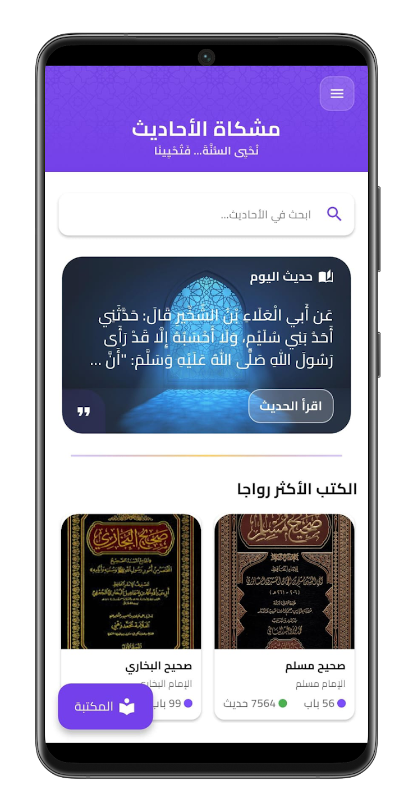
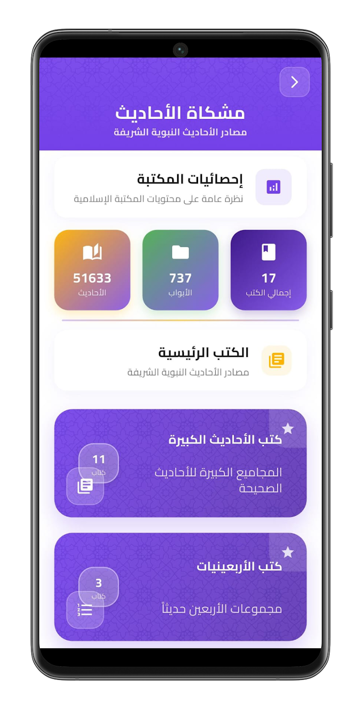
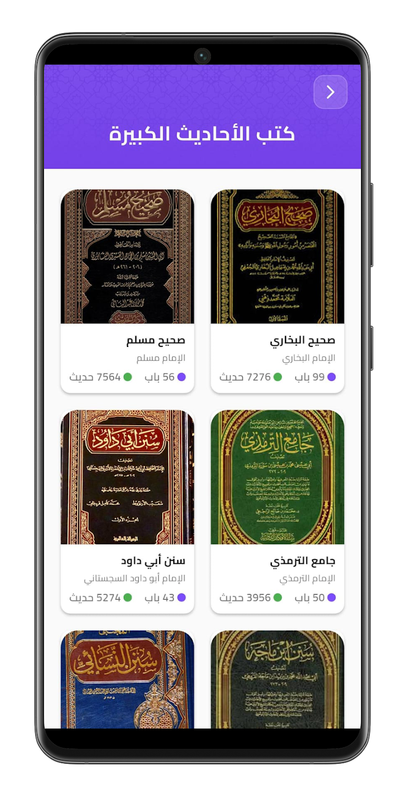
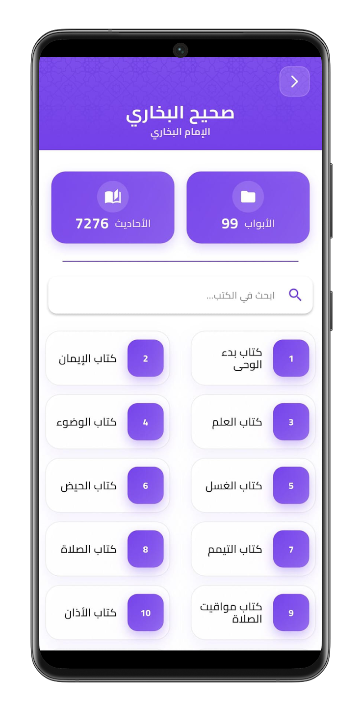
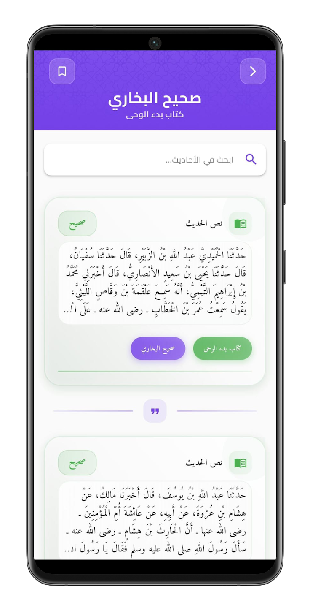
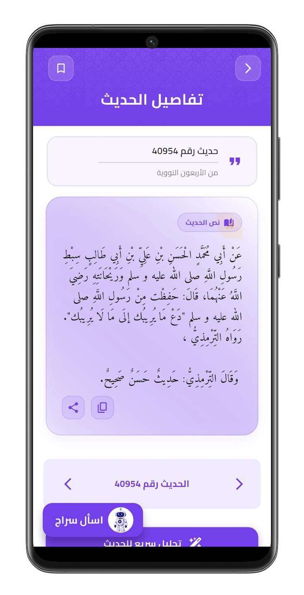
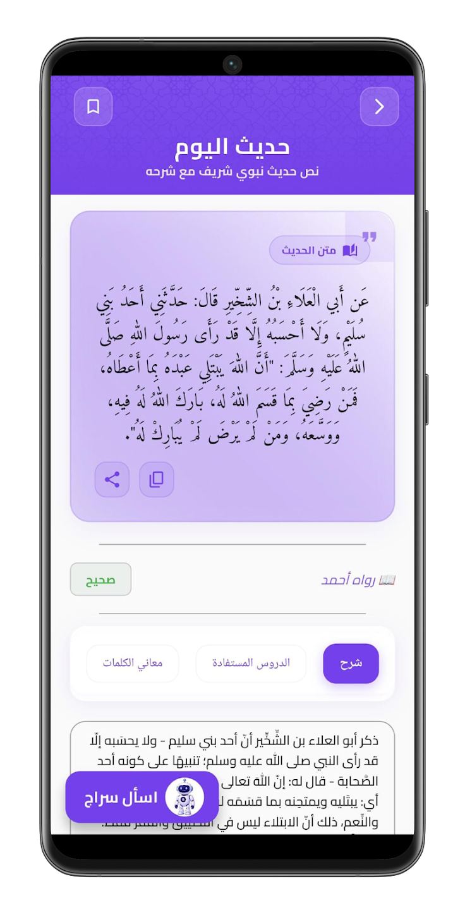

# 🕌 Mishkat Al-Ahadith

<div align="center">


[](https://play.google.com/store/apps/details?id=com.mishkat_almasabih.app&hl=ar)

**A beautifully designed Islamic Hadith library application built with Flutter**

[📥 Download from Google Play](https://play.google.com/store/apps/details?id=com.mishkat_almasabih.app&hl=ar)

</div>

---

## 📖 Table of Contents

- [🌟 Overview](#-overview)
- [✨ Features](#-features)
- [🏗️ Architecture](#️-architecture)
- [🎨 Design System](#-design-system)
- [📱 Screenshots](#-screenshots)
- [🛠️ Tech Stack](#️-tech-stack)
- [📁 Project Structure](#-project-structure)
- [🚀 Getting Started](#-getting-started)
- [🤝 Contributing](#-contributing)

---

## 🌟 Overview

**Mishkat Al-Ahadith** is a comprehensive Islamic Hadith library application that provides users with access to authentic Islamic texts, daily hadiths, and a beautiful reading experience. The app follows modern software engineering principles and implements a stunning Islamic-themed design system.

### 🎯 Key Highlights
- 📚 **17 Major Islamic Books** with comprehensive content
- 🎨 **Beautiful Islamic Design** with purple and gold colors
- 🏛️ **Clean Architecture** following SOLID principles
- 🔄 **State Management** using BLoC pattern
- 📱 **Responsive Design** optimized for all devices
- 🔤 **Full Arabic Language Support** with proper text direction
- 💾 **Offline Capabilities** with local data storage

---

## ✨ Features

### 📚 Core Library Features
- **Hadith of the Day**: A new hadith every day with explanation
- **Book Categories**: Organized by Islamic topics
- **Chapter Navigation**: Easy browsing through book chapters
- **Search Functionality**: Advanced search across all content
- **Bookmark System**: Save favorite hadiths and passages
- **Reading Progress Tracking**: Track your reading journey

### 🔐 Authentication & User Management
- **User Registration**: Create secure accounts
- **Login System**: Multiple authentication methods
- **Google Sign-In**: OAuth integration
- **Profile Management**: User preferences and settings
- **Data Synchronization**: Cloud backup and sync

### 🎨 User Experience Features
- **Islamic Design**: Authentic cultural aesthetics
- **Dark/Light Mode**: Comfortable reading in any environment
- **Responsive Layout**: Optimized for all screen sizes
- **Smooth Animations**: Enhanced user interactions
- **Accessibility**: Screen reader support and high contrast

### 📱 Technical Features
- **Offline Reading**: Download content for offline access
- **Push Notifications**: Daily hadith reminders
- **Share Functionality**: Share hadiths with others
- **Multi-Language Support**: Arabic and English interfaces
- **Optimized Performance**: Fast loading and smooth scrolling

---

## 🏗️ Architecture

### Clean Architecture Implementation

The app follows **Clean Architecture** principles with a **Feature-First** organization, ensuring maintainability, scalability, and testability.

```
┌─────────────────────────────────────────────────────────────┐
│                    PRESENTATION LAYER                       │
│                        (UI Layer)                           │
├─────────────────────────────────────────────────────────────┤
│  • Screens (UI)                                             │
│  • Widgets (Reusable Components)                            │
│  • BLoC Cubits (State Management)                           │
└─────────────────────────────────────────────────────────────┘
                              │
                              ▼
┌─────────────────────────────────────────────────────────────┐
│                  BUSINESS LOGIC LAYER                       │
│                   (Domain Layer)                            │
├─────────────────────────────────────────────────────────────┤
│  • Use Cases                                                │
│  • Business Rules                                           │
│  • Validation Logic                                         │
└─────────────────────────────────────────────────────────────┘
                              │
                              ▼
┌─────────────────────────────────────────────────────────────┐
│                       DATA LAYER                            │
│                   (Infrastructure Layer)                    │
├─────────────────────────────────────────────────────────────┤
│  • Repositories                                             │
│  • Data Sources (API/Local)                                 │
│  • Models                                                   │
└─────────────────────────────────────────────────────────────┘
```

### State Management with BLoC

- **Predictable State Flow**: Clear flow from Event → State → UI
- **Separation of Concerns**: Business logic isolated from UI
- **Testability**: Easy independent testing of business logic
- **Scalability**: Easy addition of new features and states

### Dependency Injection

- **GetIt Container**: Centralized dependency management
- **Lazy Loading**: Services initialized only when needed
- **Testability**: Easy mocking of dependencies for testing
- **Loose Coupling**: Components easily replaceable

---

## 🎨 Design System

### Islamic Color Palette

Our design system is built around authentic Islamic aesthetics:

```dart
// Primary Colors
primaryPurple: #7440E9    // Main brand color
primaryGold: #FFB300      // Islamic gold accents
secondaryPurple: #9D7BF0  // Light purple variations

// Semantic Colors
hadithAuthentic: #4CAF50  // Authentic (Green)
hadithGood: #9C27B0       // Good (Purple)
hadithWeak: #FF9800       // Weak (Orange)
```

### Typography System

- **Base Font**: Amiri (optimized for Arabic)
- **Fallback Font**: YaModernPro
- **Responsive Size**: ScreenUtil for adaptive typography
- **Hierarchical Styles**: Clear text hierarchy for better readability

### Component Design

- **Card-Based Layout**: Clean and organized information display
- **Islamic Patterns**: Subtle geometric overlays
- **Gradient Backgrounds**: Beautiful color transitions
- **Enhanced Shadows**: Visual depth and hierarchy
- **Rounded Corners**: Modern and friendly appearance

---

## 📱 Screenshots

<div align="center">

### Home Screen


### Library


### Books


### Chapters


### Ahadith


### Hadith Details


### Search Results


### Hadith of the Day


</div>

---

## 🛠️ Tech Stack

### Frontend Framework
- **Flutter 3.7+**: Multi-platform app development
- **Dart 3.7+**: Modern and type-safe programming language

### State Management
- **flutter_bloc 8.1.4**: Predictable state management
- **get_it 7.6.7**: Dependency injection container

### Networking & API
- **Dio 5.0.0**: HTTP client with interceptors
- **Retrofit 4.0.3**: Type-safe HTTP client
- **pretty_dio_logger 1.3.1**: Beautiful API logging

### UI & Design
- **flutter_screenutil 5.9.0**: Responsive design utilities
- **flutter_animate 4.5.2**: Smooth animations
- **shimmer 3.0.0**: Loading state animations
- **flutter_svg 2.2.0**: Vector graphics support

### Data & Storage
- **shared_preferences 2.5.3**: Local data persistence
- **dartz 0.10.1**: Functional programming tools

### Authentication
- **google_sign_in 6.2.2**: OAuth integration
- **permission_handler 12.0.1**: Device permissions

---

## 📁 Project Structure

```
lib/
├── core/                           # Core application layer
│   ├── di/                        # Dependency injection
│   ├── helpers/                   # Utility functions
│   ├── networking/                # API and HTTP layer
│   ├── routing/                   # Navigation management
│   ├── theming/                   # Themes and styling
│   └── widgets/                   # Shared components
├── features/                      # Feature modules
│   ├── authentication/            # Login/signup flows
│   ├── home/                     # Main dashboard
│   ├── hadith_daily/             # Daily hadith feature
│   ├── hadith_details/           # Hadith details views
│   ├── library/                  # Book library management
│   ├── bookmark/                 # Bookmark system
│   ├── search/                   # Search functionality
│   ├── profile/                  # User profile management
│   ├── chapters/                 # Chapter navigation
│   ├── ahadith/                  # Hadith content
│   ├── book_data/                # Book information
│   ├── navigation/               # Navigation logic
│   ├── notification/             # Push notifications
│   ├── main_navigation/          # Bottom navigation
│   ├── onboarding/               # User onboarding
│   └── splash/                   # Splash screen
├── main_development.dart          # Development entry point
├── main_production.dart           # Production entry point
└── mishkat_almasabih.dart        # Main app configuration
```

### Feature Module Structure

Each feature follows a consistent structure:

```
feature_name/
├── data/                          # Data layer
│   ├── models/                    # Data models
│   ├── repos/                     # Repository implementations
│   └── datasources/               # API and local data sources
├── logic/                         # Business logic layer
│   └── cubit/                     # BLoC cubits
└── ui/                            # Presentation layer
    ├── screens/                   # Main screens
    └── widgets/                   # Feature-specific widgets
```

---

## 🚀 Getting Started

### Prerequisites

- Flutter SDK 3.7.0 or higher
- Dart SDK 3.7.0 or higher
- Android Studio / VS Code
- Git

### Installation

```bash
# 1. Clone the repository
git clone https://github.com/mahmoudyoussef3/mishkat_almasabih.git
cd mishkat-ahadith

# 2. Install dependencies
flutter pub get

# 3. Run the app
flutter run
```

### Environment Setup

The app supports multiple environments:

- **Development**: `flutter run --flavor development`
- **Production**: `flutter run --flavor production`

### Build Commands

```bash
# Android APK
flutter build apk 

# Android App Bundle (for Google Play release)
flutter build appbundle

# iOS
flutter build ios
```

---

## 🤝 Contributing

We welcome contributions from the community! Please read our contributing guidelines:

### Development Workflow

1. **Fork the repository**
2. **Create a feature branch**
```bash
   git checkout -b feature/amazing-feature
```
3. **Make your changes**
4. **Commit your changes**
```bash
   git commit -m 'Add amazing feature'
```
5. **Push to the branch**
```bash
   git push origin feature/amazing-feature
```
6. **Open a Pull Request**

### Code Standards

- Follow **Flutter best practices**
- Use **Clean Architecture** principles
- Maintain **consistent naming conventions**
- Write **comprehensive documentation**

---

## 🙏 Acknowledgments

- **Islamic Scholars**: For authentic hadith content
- **Flutter Community**: For excellent development tools
- **Design Inspiration**: Traditional Islamic art and architecture
- **Contributors**: All developers who contributed to this project

---

## 🔗 Important Links

- [📥 Download from Google Play](https://play.google.com/store/apps/details?id=com.mishkat_almasabih.app&hl=ar)
- [🌐 Official Website](https://hadith-shareef.com/islamic-library)

---

<div align="center">

**Made with ❤️ for the Islamic community**

*"Seeking knowledge is obligatory upon every Muslim" - Prophet Muhammad ﷺ*

---

### ⭐ If you like this project, don't forget to give it a star!

</div>