<div align="center">
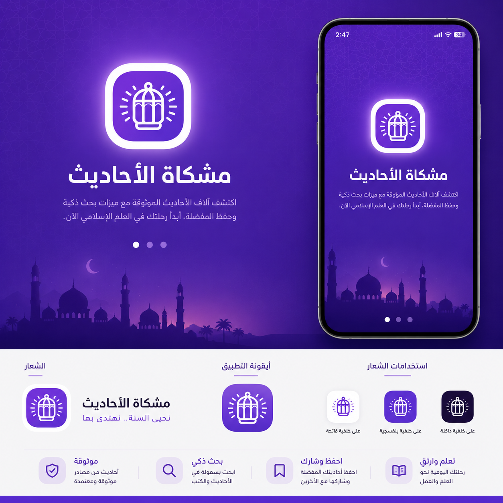

# مشكاة الأحاديث — Mishkat Al-Ahadith

### Reviving the Sunnah, one authentic hadith at a time 🌙

[](https://flutter.dev)
[](https://dart.dev)
[](https://bloclibrary.dev)
[](https://firebase.google.com)
[](#)
[](https://play.google.com/store/apps/details?id=com.mishkat_almasabih.app&hl=ar)

**A modern, offline-capable Islamic Hadith library built with Flutter** — 17 authenticated books, 51,000+ hadiths, an AI companion, prayer times, Qiblah direction, and home-screen widgets, wrapped in a clean, Arabic-first design.

[📥 Get it on Google Play](https://play.google.com/store/apps/details?id=com.mishkat_almasabih.app&hl=ar) · [🌐 Official Website](https://hadith-shareef.com/islamic-library)

<br/>

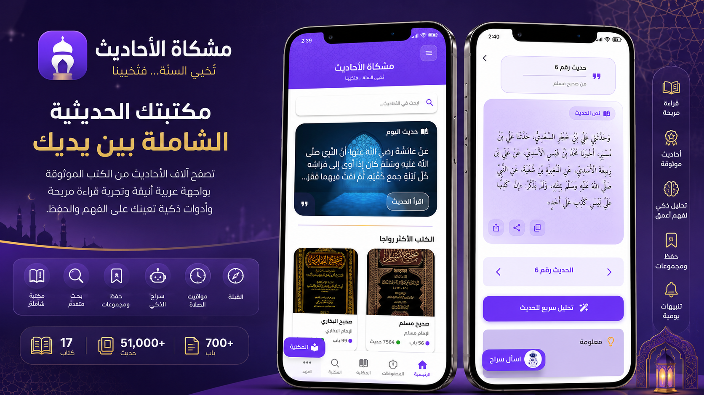

</div>

---

## 📖 Table of Contents

- [🌟 Overview](#-overview)
- [✨ Features](#-features)
  - [📚 A Complete Hadith Library](#-a-complete-hadith-library)
  - [🔍 Smart Filterable Search](#-smart-filterable-search)
  - [🌅 Daily and Random Hadith](#-daily-and-random-hadith)
  - [📌 Bookmarks and Custom Collections](#-bookmarks-and-custom-collections)
  - [🤖 Meet Serag the AI Assistant](#-meet-serag-the-ai-assistant)
  - [🕌 Prayer Times and Qiblah Finder](#-prayer-times-and-qiblah-finder)
  - [📲 Home Screen Widgets](#-home-screen-widgets)
  - [🔔 Native Notifications](#-native-notifications)
  - [🔐 Authentication](#-authentication)
  - [🧭 More in the App](#-more-in-the-app)
- [🧩 Architecture](#-architecture)
- [🎨 Design System](#-design-system)
- [🧰 Tech Stack](#-tech-stack)
- [🗂️ Project Structure](#️-project-structure)
- [🚀 Getting Started](#-getting-started)
- [🤝 Contributing](#-contributing)

---

## 🌟 Overview

**Mishkat Al-Ahadith** ("The Niche of Lamps") is a full-featured Islamic Hadith library built with Flutter. It's more than a static book reader — it pairs a huge, well-organized corpus of authenticated hadiths with modern tools: an AI assistant grounded in trusted sources, live prayer times, a Qiblah compass, and home-screen widgets, so users can read, search, save, and act on the Sunnah every day.

<div align="center">

**📚 17 books · 📄 700+ chapters · 🕋 51,000+ hadiths · 🧠 AI-assisted reading**

</div>

### Highlights

- **Massive, curated corpus** — Sahih Al-Bukhari, Sahih Muslim, Sunan Abu Dawood, Sunan At-Tirmidhi, Sunan An-Nasa'i, Muwatta Malik, and more, organized as Book → Chapter → Hadith.
- **Serag AI** — a Sharia-focused assistant that explains hadiths and answers questions, grounded in classical sources.
- **A native worship toolkit** — accurate prayer times, a Qiblah compass, and a Hijri calendar, backed by device-level scheduling that survives reboots.
- **Built to last offline** — Hive-backed local storage and cached content for a fast, reliable reading experience.
- **Arabic-first, RTL-native UI** — every screen is designed and tested right-to-left, not translated as an afterthought.
- **Clean, layered architecture** — Presentation → Domain → Data, with Cubit/BLoC state management and `get_it` dependency injection throughout.

---

## ✨ Features

### 📚 A Complete Hadith Library

Browse a huge, trustworthy hadith library organized the way scholars study it: **Books → Chapters (أبواب) → Hadiths**, plus a topical classification view (Faith, Purification, Prayer, and more) for jumping straight to a subject.

<div align="center">
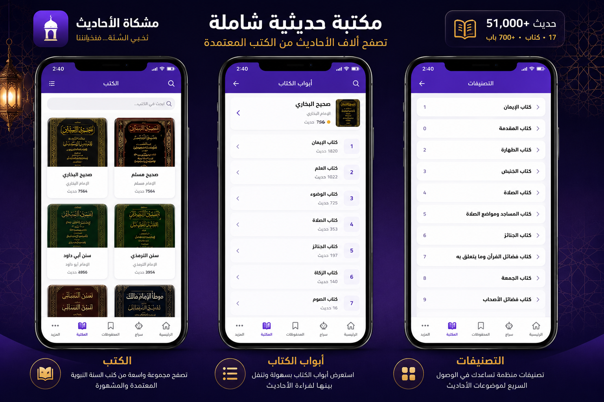
</div>

- Full book catalogue with cover art and per-book hadith counts (Sahih Al-Bukhari, Sahih Muslim, Sunan Abu Dawood, Sunan At-Tirmidhi, Sunan An-Nasa'i, Muwatta Malik...)
- Chapter-by-chapter navigation for focused reading
- Subject-based classifications for quick topical access
- Every hadith carries its authenticity grade (صحيح / حسن / ضعيف) at a glance

### 🔍 Smart Filterable Search

A search engine built for scale, searching instantly across 51,000+ hadiths.

<div align="center">
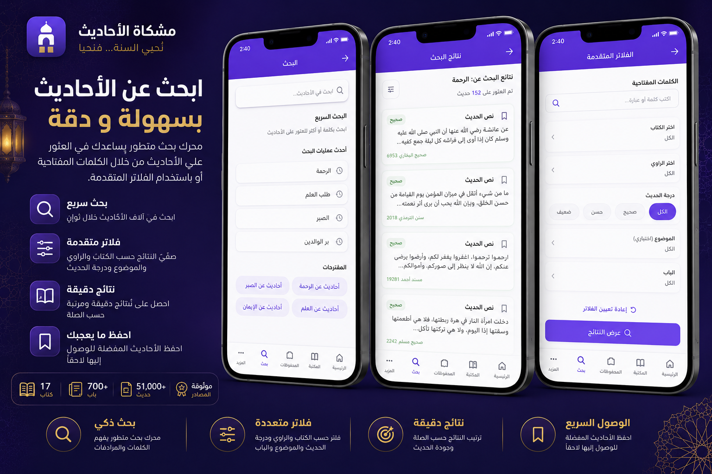
</div>

- **Quick search** with recent searches and smart suggestions
- **Advanced filters** — by book, narrator, authenticity grade, topic, and chapter
- **Ranked results** showing the matched book, grade badge, and hadith number
- One-tap **bookmarking** straight from the results list

### 🌅 Daily and Random Hadith

Two lightweight habits built right into the home screen: a curated hadith every day, and a random one whenever curiosity strikes.

<table>
<tr>
<td width="50%">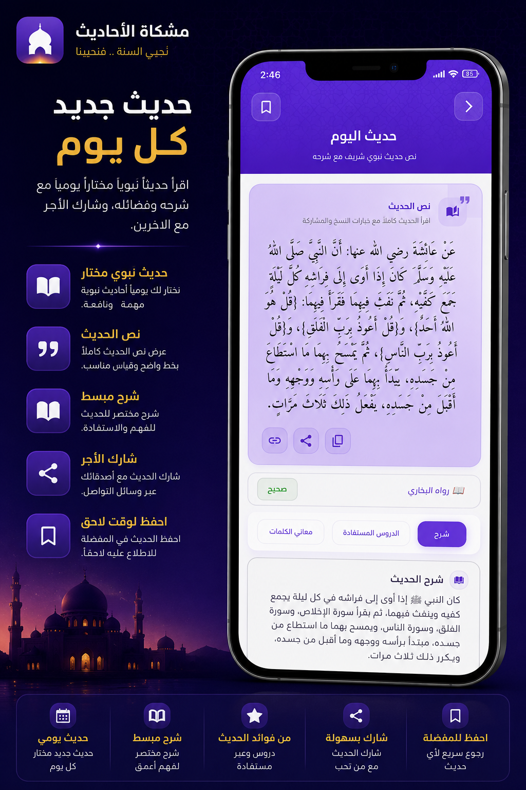</td>
<td width="50%">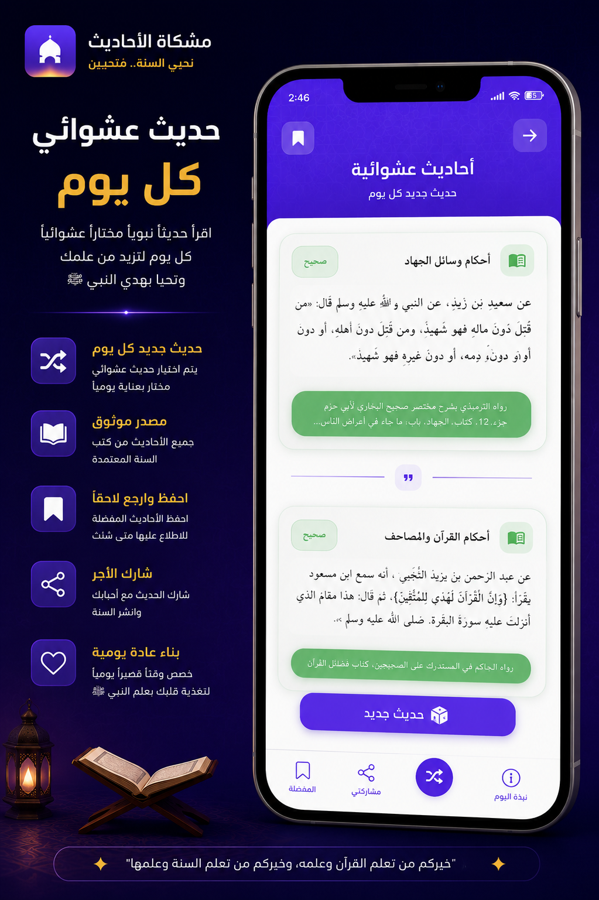</td>
</tr>
</table>

- **Hadith of the Day** — a hand-picked hadith with full text, explanation (شرح), word meanings, and lessons learned
- **Random Hadith** — a fresh pick on demand, sourced from the same authenticated corpus
- Copy, share, or bookmark any hadith in one tap
- One-tap **quick AI analysis** available on any hadith details screen for an instant breakdown

### 📌 Bookmarks and Custom Collections

Never lose track of a hadith that matters to you.

<div align="center">
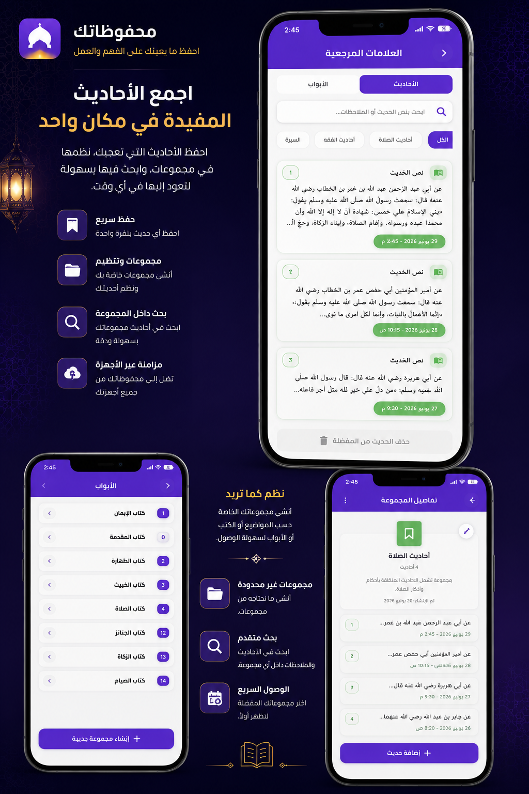
</div>

- Save any hadith with a single tap
- Organize saves into **named collections** (e.g. "Prayer hadiths", "Ramadan")
- Search inside your saved hadiths and collections
- Everything is stored locally for instant, offline access

### 🤖 Meet Serag the AI Assistant

**Serag** (سراج, Arabic for "lantern") is a Sharia-focused AI assistant built into the app: ask about a hadith or a fiqh question and get an answer grounded in trusted Islamic sources, not a generic chatbot.

<div align="center">
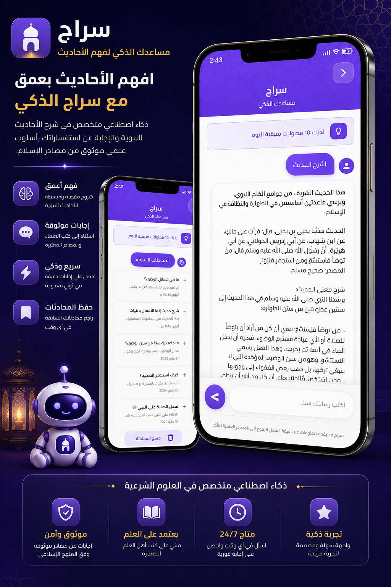
</div>

- Conversational Q&A about hadiths, meanings, and rulings
- Answers reference their sources and follow a recognized Islamic methodology
- **Chat history** is saved so you can revisit past conversations
- Daily usage is quota-based and clearly displayed to the user
- Available 24/7, directly from the hadith details screen or its own tab

> ⚠️ Like any AI assistant, Serag can get things wrong — the app is upfront about this and always points users back to authoritative sources to confirm an answer.

### 🕌 Prayer Times and Qiblah Finder

Everyday worship tools built natively, not bolted on.

<table>
<tr>
<td width="50%">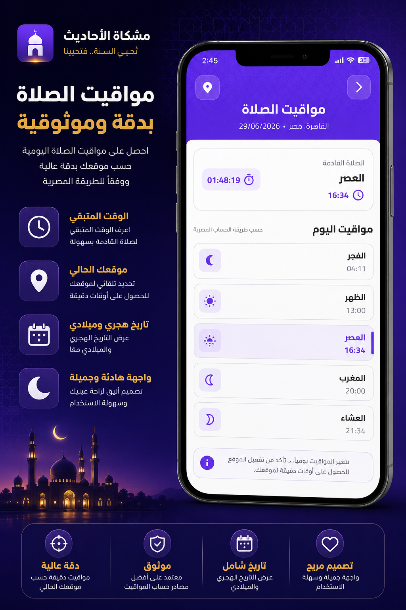</td>
<td width="50%">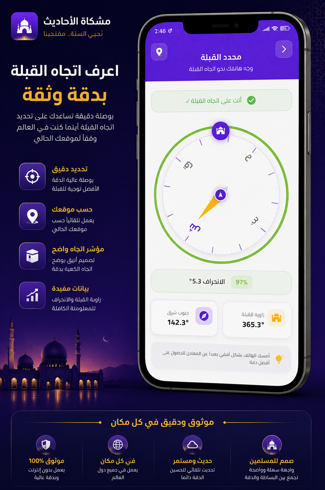</td>
</tr>
</table>

- Prayer times computed from the device's **live location**, using the Egyptian General Authority calculation method
- Countdown to the next prayer, plus the full day's schedule at a glance
- **Qiblah compass** with live bearing, deviation angle, and an accuracy indicator
- Combined **Hijri + Gregorian date** display throughout the app

### 📲 Home Screen Widgets

Take the app's most-used content to the home screen, no need to open the app.

<div align="center">
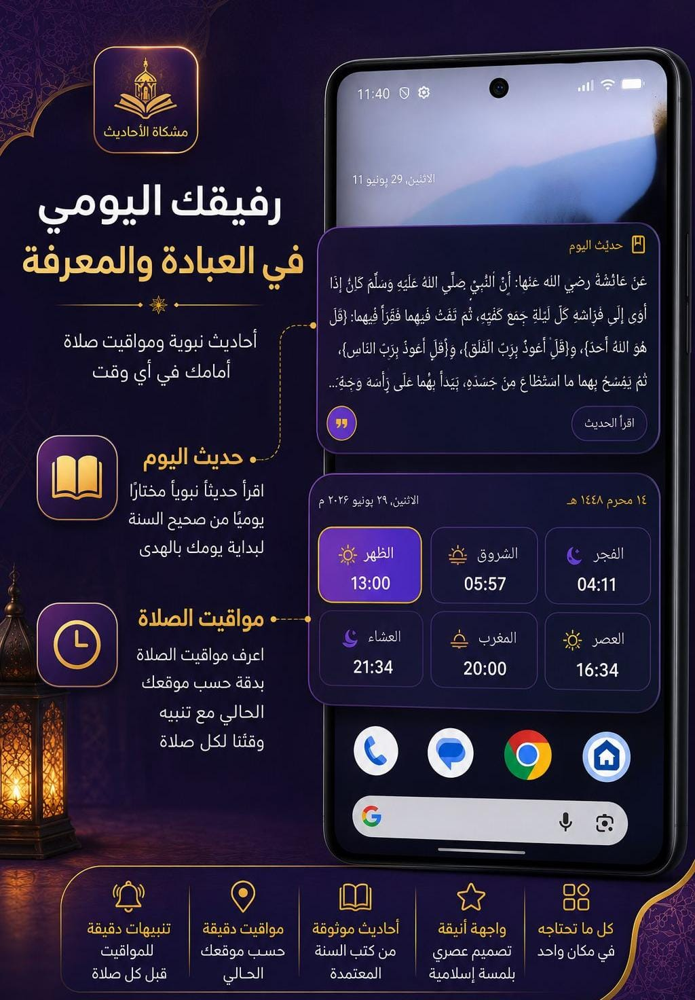
</div>

- **Hadith of the Day** widget, refreshed automatically in the background
- **Prayer Times** widget with today's full schedule
- Kept in sync via a background worker, independent of whether the app is open

### 🔔 Native Notifications

Notifications engineered at the platform level, not left to default plugin behavior.

<div align="center">
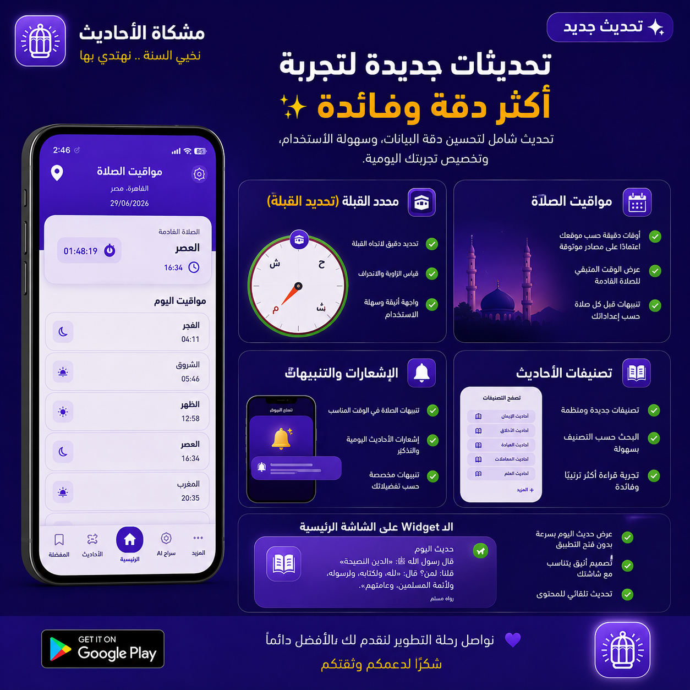
</div>

- **Exact prayer-time alarms** scheduled through Android's `AlarmManager`, delivered even while the device is idle
- Survives **reboots and timezone changes** via a native boot receiver that automatically re-schedules every alarm
- Daily hadith reminders and configurable per-prayer alerts
- Backed by Firebase Cloud Messaging for remote and push notifications

### 🔐 Authentication

A simple, privacy-respecting sign-in flow.

<div align="center">
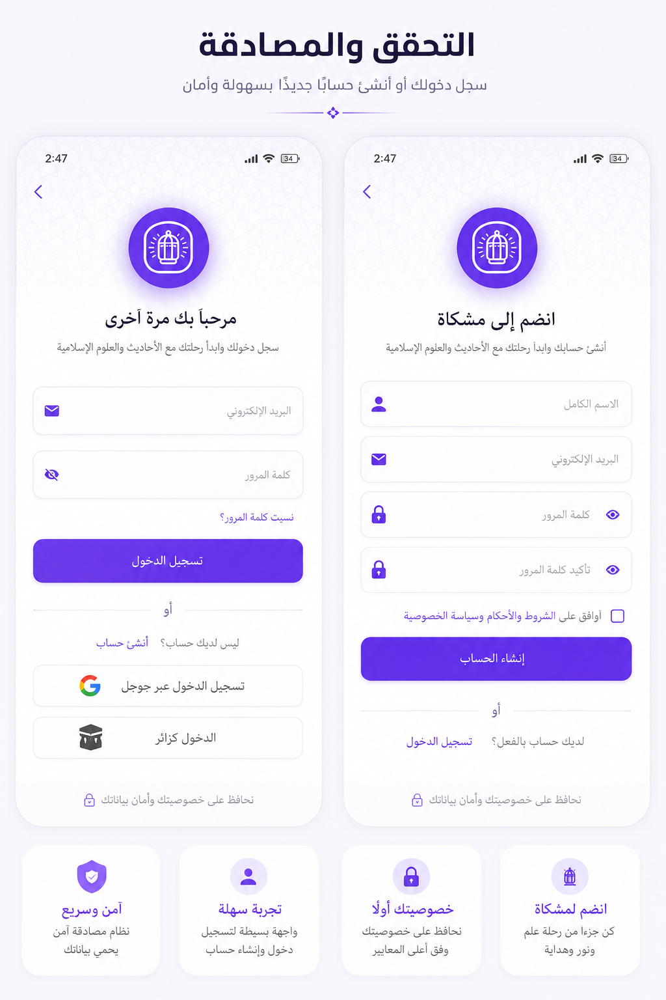
</div>

- Email & password, backed by Firebase Authentication
- **Google Sign-In**
- **Guest mode** — browse the entire library without creating an account
- Clear consent to terms and privacy policy at sign-up

### 🧭 More in the App

Rounding out the experience:

- 🗓️ **Ramadan Planner** — a daily worship checklist (prayers, Qur'an, adhkar, custom tasks) with monthly progress tracking and a calendar view
- 🔗 **Deep links & sharing** — open a shared hadith link straight into its detail screen
- 📡 **Connectivity-aware** — built with `connectivity_plus` to detect and handle offline state
- 💬 **Send Suggestions** — an in-app channel for users to submit feedback and ideas
- ℹ️ **About Us** — app and team information
- 🔁 **Smooth pagination** through tens of thousands of hadiths

---

## 🧩 Architecture

The app follows a **feature-first Clean Architecture**: every feature under `lib/features/<feature_name>/` is split into its own layers.

```
┌─────────────────────────────────────────────┐
│                PRESENTATION                  │
│    Screens · Widgets · Cubits (BLoC)         │
└───────────────────────┬───────────────────────┘
                         │ depends on
┌───────────────────────▼───────────────────────┐
│                   DOMAIN                      │
│   Use Cases · Entities · Business Rules       │
│           (zero Flutter imports)              │
└───────────────────────┬───────────────────────┘
                         │ depends on
┌───────────────────────▼───────────────────────┐
│                    DATA                       │
│  Repositories · Data Sources · Models         │
│     (Dio/Retrofit APIs, Hive, preferences)    │
└─────────────────────────────────────────────┘
```

- **State management** — `flutter_bloc` / Cubit; Cubits depend only on use cases, never on repositories or data sources directly.
- **Dependency injection** — `get_it`, registered centrally under `lib/core/di/`.
- **Routing** — centralized route names and a single app router, no ad-hoc navigation.
- **Error handling** — exceptions are caught and mapped to typed `Failure`s in the data layer; the domain layer returns a result type; the presentation layer turns failures into user-friendly states.
- **RTL by design** — directional widgets (`EdgeInsetsDirectional`, `AlignmentDirectional`) are used throughout since the app is Arabic-first.

---

## 🎨 Design System

An Islamic-inspired visual identity, defined centrally in `lib/core/theming/`:

```dart
primaryPurple    = #7440E9   // Primary brand color
primaryGold      = #FFB300   // Islamic gold accents
secondaryPurple  = #9D7BF0   // Supporting purple tones
```

- **Typography** — Amiri for Arabic hadith text, Cairo and YaModernPro for UI text
- **Responsive sizing** — `flutter_screenutil` for adaptive layouts across devices
- **Consistent components** — card-based layouts, soft gradients, and subtle Islamic geometric motifs

---

## 🧰 Tech Stack

| Category | Packages |
|---|---|
| **Framework** | Flutter 3.7+, Dart 3.7+ |
| **State Management** | flutter_bloc, get_it |
| **Networking** | dio, retrofit, pretty_dio_logger |
| **Local Storage** | hive, hive_flutter, shared_preferences |
| **Firebase** | firebase_auth, firebase_messaging, firebase_remote_config, firebase_crashlytics, firebase_analytics, firebase_performance |
| **Prayer & Location** | adhan, flutter_qiblah, geolocator, hijri, flutter_timezone |
| **Home Screen & Background** | home_widget, workmanager |
| **Auth** | google_sign_in, firebase_auth |
| **Deep Linking** | app_links |
| **UI/UX** | flutter_screenutil, flutter_animate, shimmer, flutter_svg, font_awesome_flutter |
| **Other** | dartz (functional error handling), infinite_scroll_pagination, share_plus, permission_handler, connectivity_plus |

The app ships as **development** and **production** flavors, and uses **Shorebird** for over-the-air code push between store releases.

---

## 🗂️ Project Structure

```
lib/
├── core/                       # Shared, app-wide layer
│   ├── di/                     # get_it service locator setup
│   ├── networking/             # Dio client, interceptors, API contracts
│   ├── notification/           # Local + push notification pipeline
│   ├── deep_links/             # Deep link routing
│   ├── services/               # Hive, home-widget sync, background workers
│   ├── routing/                # Centralized routes & app router
│   ├── theming/                # Colors, typography, decorations
│   └── widgets/                # Shared, reusable UI components
├── features/
│   ├── authentication/         # Login / sign-up
│   ├── home/                   # Main dashboard
│   ├── library/ chapters/ ahadith/ ahadith_categories/ book_data/
│   ├── search/ search_with_filters/
│   ├── hadith_daily/ random_ahadith/ hadith_details/ hadith_analysis/
│   ├── bookmark/
│   ├── serag/ remaining_questions/     # AI assistant
│   ├── prayer_times/ qiblah_finder/ hijri_date/
│   ├── ramadan_tasks/
│   ├── profile/ send_suggestion/ about_us/
│   └── notification/ navigation/ main_navigation/ onboarding/ splash/
├── main_development.dart       # Development entry point
├── main_production.dart        # Production entry point
└── mishkat_almasabih.dart      # Main app configuration
```

Each feature keeps this shape:

```
feature_name/
├── data/           # Models, repositories, data sources
├── domain/         # Entities, use cases (pure Dart, no Flutter imports)
└── presentation/   # Screens, widgets, cubits
```

---

## 🚀 Getting Started

### Prerequisites

- Flutter SDK ≥ 3.7.0
- Dart SDK ≥ 3.7.0
- A configured Firebase project (`google-services.json` / `GoogleService-Info.plist`)

### Installation

```bash
git clone https://github.com/mahmoudyoussef3/mishkat_almasabih.git
cd mishkat_almasabih
flutter pub get
flutter run
```

### Flavors

```bash
flutter run --flavor development -t lib/main_development.dart
flutter run --flavor production  -t lib/main_production.dart
```

### Building

```bash
flutter build apk           # Android APK
flutter build appbundle     # Android App Bundle (Google Play)
flutter build ios           # iOS
```

---

## 🤝 Contributing

Contributions are welcome!

1. Fork the repository
2. Create a feature branch: `git checkout -b feature/amazing-feature`
3. Commit your changes: `git commit -m "Add amazing feature"`
4. Push the branch: `git push origin feature/amazing-feature`
5. Open a Pull Request

Please keep changes consistent with the project's Clean Architecture, use Cubit/BLoC for state management, and avoid introducing new state-management or DI approaches without discussion first.

---

<div align="center">

**Made with ❤️ for the Islamic community**

*"Seeking knowledge is obligatory upon every Muslim." — Prophet Muhammad ﷺ*

[📥 Download on Google Play](https://play.google.com/store/apps/details?id=com.mishkat_almasabih.app&hl=ar) · [🌐 hadith-shareef.com](https://hadith-shareef.com/islamic-library)

### ⭐ If this project inspires you, consider giving it a star!

</div>
