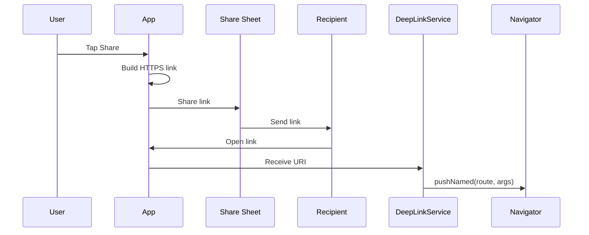
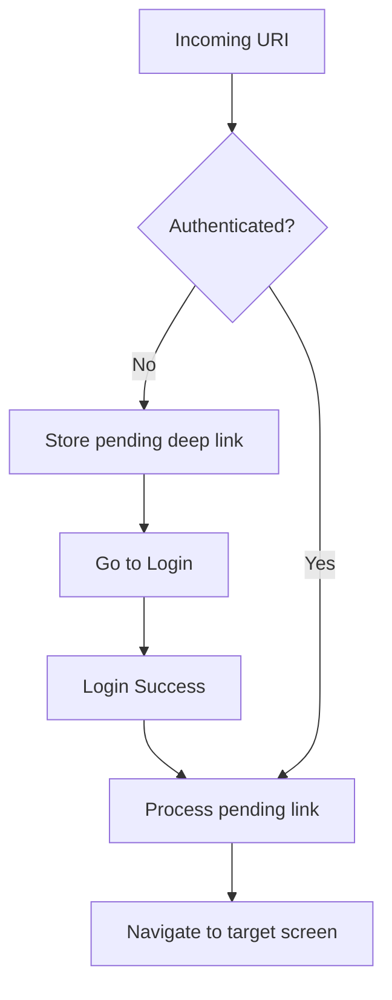
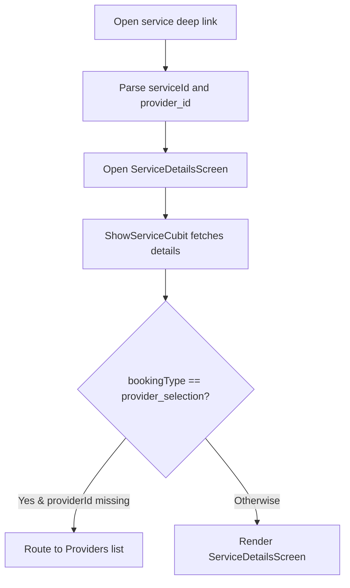

# Share Links + Deep Links

Professional reference for the end-to-end share and deep-link workflow for:
- `ServiceDetailsScreen`
- `StayServiceDetailsScreen` (Stay In / Stay Out)
- Auth-aware deep-link handling (defer until login)

---

## 1) Overview

This feature provides:
- HTTPS deep links built with `Uri.https(...)`
- System share sheet integration via `share_plus`
- Central parsing and routing in `DeepLinkRouter`
- Authentication gate with pending-link resume
- Duplicate navigation protection
- Support for cold start, background, and foreground states

---

## 2) Deep Link URL Schema

### Service Details
```
https://test.midas-misr.com/service/{serviceId}
https://test.midas-misr.com/service/{serviceId}?provider_id={providerId}
```

Examples:
```
https://test.midas-misr.com/service/45
https://test.midas-misr.com/service/45?provider_id=9
```

### Stay Service Details
```
https://test.midas-misr.com/stay/{serviceId}?mode=stay_in
https://test.midas-misr.com/stay/{serviceId}?mode=stay_out
```

Example:
```
https://test.midas-misr.com/stay/123?mode=stay_in
```

---

## 3) Routing Matrix

| Link Type | Required Params | Optional Params | Target Route | Notes |
|---|---|---|---|---|
| Service details | `serviceId` | `provider_id` | `Routes.serviceDetailsScreen` | If `provider_id` is present, open provider-specific details. |
| Stay details | `serviceId`, `mode` | None | `Routes.stayServiceDetailsScreen` | `mode` must be `stay_in` or `stay_out`. |

---

## 4) Flow Graphs

### Share -> Open -> Navigate


### Auth Gate + Pending Link Resume


### Service Details Resolution


---

## 5) Key Components

### Core Routing and Parsing
- `lib/midas_misr/features/deep_link/deep_link_router.dart`
  - Central URI parsing and validation
  - Maps deep links to `Routes.*`
  - Builders:
    - `buildServiceDetailsLink(...)`
    - `buildStayServiceDetailsLink(...)`
  - Types:
    - `StayMode`
    - `ServiceDeepLinkArgs`
    - `StayDeepLinkArgs`

### Deep Link Runtime Handling
- `lib/midas_misr/features/deep_link/deep_link_service.dart`
  - Cold start and runtime listeners (`app_links`)
  - Auth gate + pending deep link
  - Duplicate handling

### Router Integration
- `lib/midas_misr/core/routing/app_router.dart`
  - Accepts both `ServiceDetailsArgs` and `ServiceDeepLinkArgs`
  - Only uses guaranteed fields (serviceId, optional providerId)

### Share APIs
- `lib/midas_misr/features/deep_link/deep_link_share_service.dart`
  - `shareServiceDetails(serviceId, providerId?)`
  - `shareStayServiceDetails(serviceId, mode)`

---

## 6) Usage Examples

### Share a service
```dart
DeepLinkShareService.shareServiceDetails(serviceId: 45);
DeepLinkShareService.shareServiceDetails(serviceId: 45, providerId: 9);
```

### Share a stay service
```dart
DeepLinkShareService.shareStayServiceDetails(
  serviceId: 123,
  mode: StayMode.stayIn,
);
```

### Build links without sharing
```dart
final linkA = DeepLinkRouter.buildServiceDetailsLink(serviceId: 45);
final linkB = DeepLinkRouter.buildServiceDetailsLink(
  serviceId: 45,
  providerId: 9,
);
final linkC = DeepLinkRouter.buildStayServiceDetailsLink(
  serviceId: 123,
  mode: StayMode.stayOut,
);
```

---

## 7) Validation Rules

- Scheme must be `https`
- Host must be `test.midas-misr.com` or `www.test.midas-misr.com`
- `serviceId` and `provider_id` must be numeric if present
- `mode` must be `stay_in` or `stay_out` for stay links

Invalid links are ignored safely.

---

## 8) Testing Checklist

1. Share from `ServiceDetailsScreen` with and without `providerId`.
2. Share from `StayServiceDetailsScreen` with both stay modes.
3. Open links while logged in -> direct navigation.
4. Open links while logged out -> login -> auto resume.
5. Test cold start, background, and foreground.
6. Verify invalid links are ignored:
   - wrong host
   - non-numeric IDs
   - missing or invalid `mode`

---

## 9) Extension Pattern (Scalable)

When adding new deep links:
1. Add a new `DeepLinkAction` in `deep_link_router.dart`.
2. Update `parse(...)` with strict validation.
3. Add a `toRoute(...)` mapping.
4. Keep screens minimal; load full data via Cubit.
